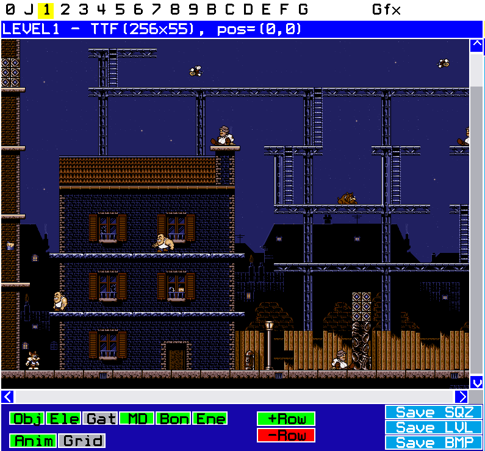
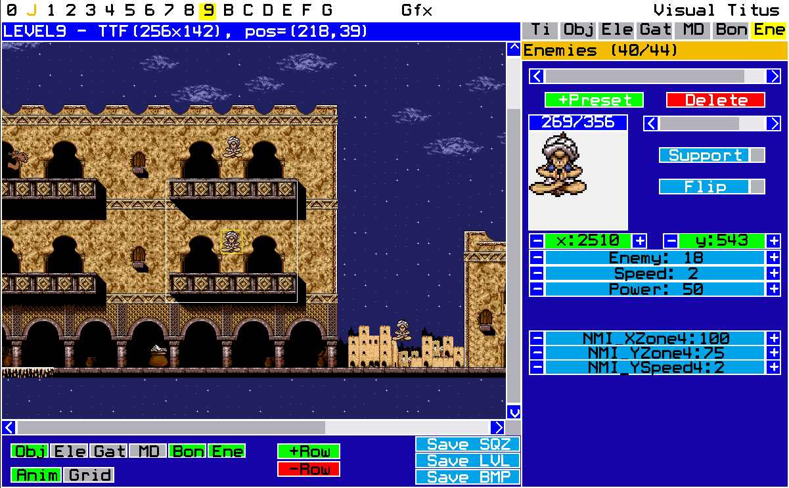

# Visual Titus - TTF/Moktar Editor

Current version: Open beta

[Usage instructions](#start)

[Starting the editor](#start)

[ Tilemap](#tilemap) \
[ Editing tilemap](#tilemap) \
[ Editing tiles](#tiles)

[ Game objects](#objects) \
[ Objects](#objects) \
[ Elevators](#elevators) \
[ Gates](#gates) \
[ Level Metadata](#md) \
[ Enemies](#enemies)

[ Graphics](#gfx) 

[ How to play](#htp)

[Thanks and acknowledgments](#thanks)

[Contact](#contact)

### Starting the editor
When starting the program, the About-screen will be loaded. On the top of the screen are the main buttons labeled 0-G, which correspond to level files, a Gfx editor and a link back to the About-window.

### Functions
Ctrl+Shift+M: Change mode between Moktar and TTF. The mode will decide which sprites and palette are loaded when opening a level file. If a level is already loaded, it needs to be closed and reloaded before this change takes effect.

### Buttons:
0-G: Will load the corresponding LEVEL?.SQZ-file from the working directory. If an LVL-file of the same name exists, it will be loaded instead. (LVL is just an uncompressed version of the SQZ) \
Ctrl+Shift+Button 0-G: Close the level if it is open. \
Gfx: Opens the graphics editor. See separate section. \
Visual Titus: The About-window.

You can have several levels open at once, and copy and paste tilemap selections, tile graphics and level objects between them.

To manipulate objects of any given type, the corresponding object-window on the right side needs to be active. You can cycle between object-windows using Tab and Shift+Tab, or clicking the corresponding window's button.

### Tilemap
When a level is open, the tilemap will show in the main grid on the left side of the screen.

#### Editing tilemap

Functions: \
Arrow Keys: Move grid in the direction. Hold shift to move 10 units at a time. \
Mouse Wheel: Scroll grid up and down, or if holding shift - left and right. \
Left click grid: Set select position, indicated by a yellow square. \
Right click grid: Set clicked tile to the selected tile. (paint) \
Ctrl+Left click: Set the selected tile to be the clicked tile. \
Shift+Left click: Create selection rectangle from the selected  \position to the clicked tile. Indicated by a red rectangle. \
Ctrl+C: Copy tilemap selection to clipboard. \
Shift+V: Show where clipboard would be pasted. (to avoid errors) \
Ctrl+V: Paste tilemap selection from clipboard. \
Ctrl+S: Save open file to SQZ 

Buttons: \
Obj, Ele, Gat, MD, Bon, Ene: Toggle whether to show objects, enemies, gates, meta data, bonuses and enemies, respectively. \
Anim: Toggle tilemap animation \
Grid: Show gridlines. \
+Row: Insert row with the selected tile value at the cursor. \
Shift + +Row: Insert row below cursor. \
Shift + -Row: Delete row at cursor. \
Shift + Save SQZ \
Save LVL: Save the level uncomressed or compressed. \
Save BMP: Save the level as a bitmap with the selected objects present. (gates excluded for now)

#### Editing tiles

On the right side of the screen one of seven sub-windows will be shown. The first one is "Ti", which is the tile window with a tile grid. The selected tile is indicated by a yellow square, and the properties of the selected tile will be shown below. In addition, a big version of the tile and its tile number will be shown on the right. \
\
When copying and pasting from the tile grid, it has to be active - the mouse cursor needs to be above it. The outline will flash in yellow to indicate this.

 Functions: (when mouse cursor is above tile grid) \
 Left Click: Select tile \
 Shift+Left Click: Create selection rectangle. \
 Ctrl+C: Copy tile graphic selection to clipboard. \
 Shift+V: Show where the clipboard would be pasted. \
 Ctrl+V: Paste clipboard at the selected position. Tile metadata will be pasted along with the graphics.

Buttons: \
Left side radio buttons; The tile's horizontal properties - can be None, Wall, Health, Level Code, Padlock and Level 14 Code, respectively.\
Middle radio buttons; The tile's floor properties - can be None, Floor, Slippery (1-3), Drop-Through, Ladder, Health, Water, Fire, Spikes, Level Code, Padlock and Level 14 Code, respectively. \
Right side radio buttons; The tile's ceiling properties - can be None, Ceiling, Ladder, Padlock or Deadly, respectively. \
The animation checkbox indicates whether this tile and the two next ones are part of a 3-cycle animation. \
\
Flash: Will flash the selected tile on the tilemap grid - to quickly see where it is used. \
Shift+Remap: Will remap the tile at the tilemap cursor to the selected tile in the tile grid. If an area has been selected, the remap will only happen in that rectangle. \
Ex BMP: Export the tilemap as a 256x256 256-color BMP. \
Im BMP: Import a 256x256 256-color BMP to replace the tile graphics. This will not change the tile metadata. The image will be recolored to most closely match the level's palette. Palette index 0 and 2 will both point to black for some reason. Transparency is not possible even for the bonus objects, but we decided to let the color (r,g,b)=(160, 64, 192) denote palette entry 0 on import and export.

### Game objects

## Objects

The second sub-window is the Objects window ("Obj"). The top slider lets you cycle between objects in the level, and the sprite slidebar lets you select sprite number. A big version of the selected tile will be drawn on a flashing background. The background color is yellow-ish if the selected sprite was not used in the original game, otherwise white-ish.

Functions: \
Ctrl+C: Copy selected object to clipboard \
Ctrl+V: Paste clipboard at cursor. \
Shift + Left Click: Move selected object to mouse position. \
Ctrl + Left Click: Move selected object to mouse position, and snap to grid. \
Ctrl + F: Focus on the selected object on the tilemap grid.

Buttons: \
\+ Preset: Copy a preset object to clipboard. \
Delete: Delete selected object from level. \
Support: Set sprite to be solid. \
Flip: Flip sprite horizontally. \
Inc/Dec: Increase positions by 1, or 10 if shift is held.

Note: For the sprite selector, hold shift and click the < or > arrows to cycle between sprites that were used in the original game.

## Elevators

The third sub-window is the Elevators window ("Ele"). When open, the elevators of the level can be edited. We also draw a rectangle indicating how far the elevator reaches before returning.

The functions and the buttons are the same as for the objects screen, with the added buttons for selecting speed (1-8), and range in pixels. The direction can also be modified.

## Gates

The fourth sub-window is the Gates window ("Gat"). When open, the gates of the level can be edited. No graphics are associated with gates in the game, but we draw the entry, exit and camera with green, red and yellow rectangles, respectively. The gates therefore come in threes, numbered from 01 and up. On the picture above, the exit and exit camera positions of gate 1 can be seen.

The functions and the buttons are the same as for the objects screen, but this screen has a sub-selection marked in yellow on the right. When moving or focusing on the tilemap grid, the selected sub-object will be considered.

The gate entry and camera can be moved independently, but when moving the exit the camera will move with it.

When pasting a gate from clipboard, only the entrance will be placed at the mouse position. The exit and camera will retain their original values until they are moved.

If scrolling is disabled, the game will not scroll when exiting the gate.

## Level metadata

The fifth sub-window is the Metadata window ("MD"). When open, some meta-properties of the level can be seen - modeled as four sub-objects: \
Level start position, modeled by Titus/Moktar. \
Level end position, same sprite but flipped. \
vscroll: Vertical line which stops the screen from scrolling right when the player is to the left of it. \
hscroll: Horizontal line which stops the screen from scrolling down when the player is above it.

The scrolling limits can be seen in the picture as long thin rectangles. These, as well as the  entry/exit positions, can be moved on the grid as usual. Focusing also works.

There is no copy/paste/insert/delete in this window.

## Bonuses

The sixth sub-window is the Bonuses window ("Bon"). When open, the bonus-objects of the level can be edited. These are health items, padlocks, level code lamps and "edible" tiles that will reveal a tile beneath.

Each bonus is associated with two tiles, one foreground and one background. If you select "inherit from tilemap", the editor will automatically - when saving to file - assign whichever tile is behind the bonus on the tilemap to this value.

The inherit-property will also be set automatically on file load if the tile beneath the bonus equals the tilemap at the bonus' position.

If the inherited property is not set, the background tile is shown with a white selector in the tile grid. This can also be set by right-clicking on the grid.

The actual properties for health, padlock, level code and level 14 code are set on the tiles themselves. Only tiles 253-255 can be used for health, other "edible" bonus tiles will simply disappear when touched.

Copy/Paste and Focus work as usual.

## Enemies

The seventh sub-window is the Enemies window ("Ene").

This is the only screen where the property list is dynamic, because the properties depend on enemy number. These properties also share memory and do not move independently.

The sprite selector will also filter on enemy number, so you can see which sprites were used in the original game for any enemy number. (Enemy #16 was not used at all) This will give you an idea about the enemy behavior.

For most enemy numbers, one or two rectangles are associated with the enemy. These are things like moving ranges, shooting ranges and alert zones. Play around with enemies and enemy parameters to get a feel for how it actually works in the game.

Copy/Paste and Focus work as usual, and it might sometimes be a good idea to copy enemies from an original game level, paste it in your level - and then tweak the parameters.

Click on the "Enemy #"-button to see a description of the enemy's behavior. Cycling between original sprites used for the enemy number will also give a clue.

The increments and decrements go by 1, 10 if shift is held, 100 if ctrl is held, and 1000 if ctrl AND shift are held.

Some enemies are associated with a horizontal midpoint, which is given in absolute x-coordinates. (and shows as two adjacent rectangles) When moving the enemy on the grid these properties will not be changed automatically - so in this case use the increment/decrement buttons.

Note! One special case: \
One property for enemy #2 consists of a range and a shooting direction. The button indicates both values. In this case the button itself can be clicked to change direction quickly. (cycle between [B]oth, [L]eft and [R]ight)

## Graphics

We support altering the tile graphics in the level editor itself, but we also built a separate screen for altering the rest of the graphic files.

On the left side of the screen the possible graphic file names are listed.

For the 16-color images the palette is prepopulated, whereas for the 256-color images the palette is part of the file data.

In either case the buttons do as you would expect; import and export BMP, save and load SQZ. The imported BMPs must be 256-color images (they will be recolored to match the palette for 16-color images) AND they need to have the expected dimensions.

FONTS, SPREXP (TTF sprites) and SPRITES (Moktar sprites) contain more than one image, and will be exported to BMPs numbering from 2 for the second image. For FONTS - the exported filenames will be FONTS.BMP, FONTS2.BMP, FONTS3.BMP and so on. For multi-import, the same file names are expected.

For sprites and fonts, the color rgb=(160, 64, 192) indicates transparency. Otherwise edit the exported images to know which colors the resultant image will support. The rest will be recolored to the nearest palette color using cartesian distance.

### How to play

The options the author knows of are:

Using a modern port: [OpenTitus](http://opentitus.sourceforge.net/) - An excellent SDL port \
Using the original game: [Moktar the Fox](http://ttf.mine.nu) - A classic tool for (among other things) letting you play modified levels with the original game engine.

### Thanks and acknowledgments
Thanks to Eirik Stople for creating OpenTitus \
Thanks to Jesses for compiling and hosting the [file format technical documentation](http://ttf.mine.nu/techdocs.htm) \
Shout-out to the [DOS Game Modding Wiki](https://moddingwiki.shikadi.net/wiki/Main_Page)

### Contact
The author, Kai E. Frøland, can be contacted via:

e-mail: kaimitai@pm.me \
Threema: [79K5EKHC](https://threema.id/79K5EKHC)
